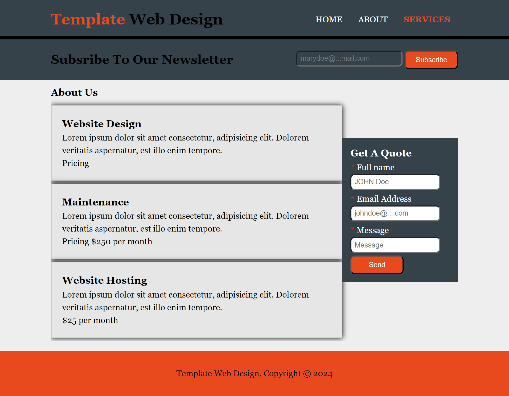
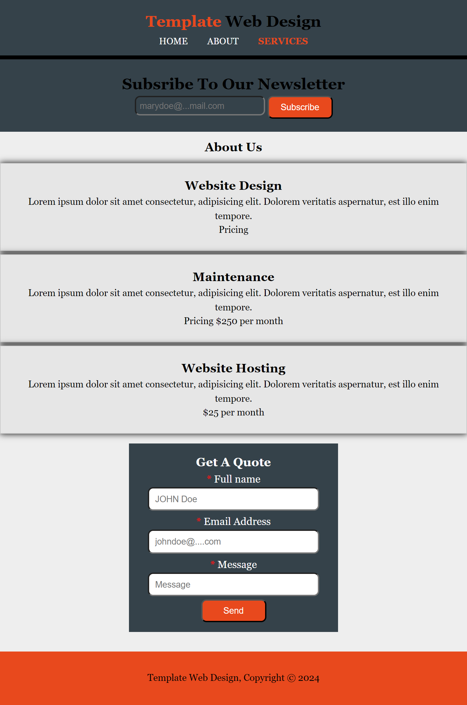

# TEMPLATE Web-Design

## Description
Hey there, fellow design enthusiasts and curious minds! Welcome to our little corner of the web where creativity meets functionality. [Project Name] isn't just another web design showcase—it's a journey through the art and science of crafting digital experiences that delight and inspire.
[Link](https://template-web-design.netlify.app/)

## Key Features
+ User-friendly Navigation: Create intuitive navigation menus and pathways to help users find what they're looking for easily.

+ Contact Form: Provide a convenient way for visitors to get in touch with you for inquiries or collaboration opportunities.

+ Responsive Design: Ensure that your website looks great and functions seamlessly across all devices and screen sizes.

Here is the design on Tablet screen sizes:

Here is also the design on Tablet screen sizes:

## Technologies Used:
This website was built with only **HTML**, **CSS** and **JavaScript**.

## License
MIT License

## Acknowledgements
[Traversy Media](https://www.traversymedia.com/).